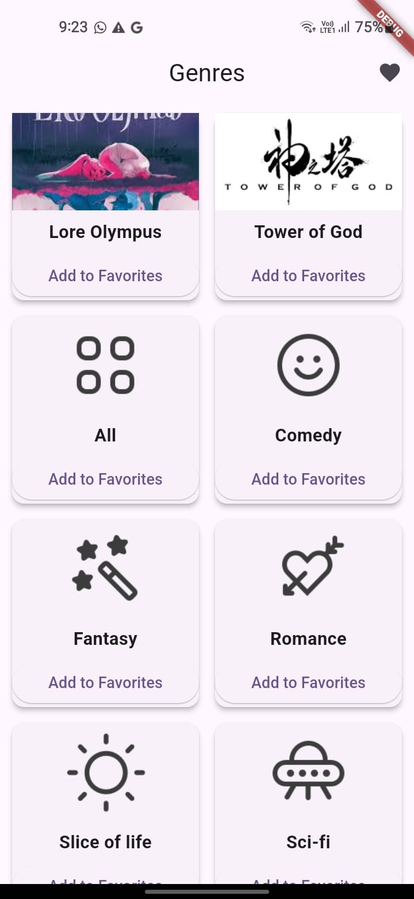

# Webtoon App

A Flutter app that allows users to browse webtoon genres and view detailed information about selected webtoons. Users can also add their favorite webtoons to a favorites list.

## Features

- Browse a list of webtoon genres.
- View detailed information about a selected webtoon, including images and descriptions.
- Add webtoons to favorites.

## Screenshots

| Home Screen | Detail Screen |
|-------------|---------------|
|  |  |

## Getting Started

### Prerequisites

To run this project, you need the following:

- [Flutter](https://flutter.dev) installed on your machine.
- A working internet connection to fetch webtoon data from the API.

### Installation

1. Clone the repository:

   ```bash
   git clone https://github.com/YOUR_USERNAME/webtoon-app.git
   cd webtoon-app


## License

This project is licensed under the MIT License - see the [LICENSE](LICENSE) file for details.

### Instructions for Adding Screenshots:
1. Inside your project directory, create a folder named `screenshots`.
2. Place your screenshots (e.g., `home_screen.png`, `detail_screen.png`) inside this folder.
3. The above Markdown code will automatically display these screenshots in your GitHub repository's `README.md` file. Just make sure to match the file names accordingly.
